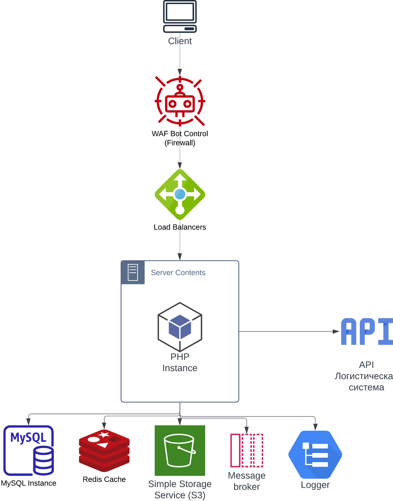

# Предисловие
## Между какими СУБД стоял выбор и почему не они
**Triple-Stores**(SPARQL) - нет явной потребности в работе с 
семантическими данными или RDF, использование Triple-Stores 
или SPARQL может быть излишним и усложнить разработку без 
необходимости.

**Neo4j** или **GraphDB** - не требуется сложных операций с графовыми 
связями, использование графовых баз данных может быть избыточным и 
усложнить разработку без реальной выгоды.

**Postgres** - базу данных рано или поздно в растущем бизнесе потребуется скейлить. 
В MySQL делать это проще, чем в Postgres. Есть [отличная статья](https://www.uber.com/en-DE/blog/postgres-to-mysql-migration/) на эту тему.


# Схема компонентов системы
Схема включает следующие компоненты: сервер, база данных (MySQL), кеш (Redis), логистическая система, S3 Bucket,
балансировщик нагрузки и клиент.


# Описание схемы БД
Изображение схемы БД можно найти [здесь](database.png) или код в [sql файле](database.sql).
### Таблица "s3_objects":
> Содержит названия городов.

**id**: Уникальный идентификатор города (автоинкрементируемое поле).

**name**: Название города

### Таблица "s3_objects":
> Хранит информацию о файлах в S3-хранилище.

**id**: Уникальный идентификатор файла (автоинкрементируемое поле).

**file_name**: Имя файла

**mime_type**: MIME-тип файла (например, “image/jpeg”).

**file_size**: Размер файла в байтах.

**upload_date**: Дата и время загрузки файла.

### Таблица "groups":
> Хранит информацию о группах.

**id**: Уникальный идентификатор группы (автоинкрементируемое поле).

**image_id**: Вторичный ключ s3_objects.id

**name**: Имя группы

### Таблица "categories":
> Хранит информацию о категориях.

**id**: Уникальный идентификатор категории (автоинкрементируемое поле).

**group_id**: Вторичный ключ groups.id

**image_id**: Вторичный ключ s3_objects.id

**name**: Имя группы

### Таблица "subcategories":
> Хранит информацию о подкатегориях.

**id**: Уникальный идентификатор категории (автоинкрементируемое поле).

**category_id**: Вторичный ключ category.id

**image_id**: Вторичный ключ s3_objects.id

**name**: Имя группы

### Таблица "products":
> Хранит информацию о товарах.

**id**: Уникальный идентификатор товара (автоинкрементируемое поле).

**total_quantity**: Количество товаров на всех складах

**archived**: Архивирован ли товар

**subcategory_id**: Вторичный ключ subcategory.id


### Таблица "prices_by_city":
> Хранит информацию о ценах товаров по городам.

**id**: Уникальный идентификатор цены по городу (автоинкрементируемое поле).

**product_id**: Вторичный ключ products.id

**city_id**: Вторичный ключ city.id

**price**: Цена товара


### Таблица "product_versions":
> Хранит информацию о версиях товаров.

**id**: Уникальный идентификатор версии товара (автоинкрементируемое поле).

**product_id**: Вторичный ключ products.id

**image_id**: Вторичный ключ s3_objects.id

**name**: Название товара в этой версии

**price**: Цена товара в этой версии


### Таблица "product_attributes":
> Хранит информацию о дополнительных атрибутов товара.

**id**: Уникальный идентификатор дополнительного атрибута (автоинкрементируемое поле).

**product_version_id**: Вторичный ключ product_versions.id

**name**: Название атрибута

**value**: Значение атрибута


### Таблица "users":
> Хранит информацию о пользователях.

**id**: Уникальный идентификатор пользователя (автоинкрементируемое поле).

**full_name**: Полное имя пользователя

**role**: Роль пользователя

**email**: Почта пользователя

**password**: Хеш пароля пользователя

**last_login**: Timestamp последнего времени входа пользователя

**force_logout**: Нужно ли разлогинить пользователя

**verified**: Подтвержден ли email пользователя

**registered_at**: Timestamp регистрации пользователя


### Таблица "carts":
> Хранит информацию о корзинах.

**id**: Уникальный идентификатор корзины (автоинкрементируемое поле).

**user_id**: Вторичный ключ users.id

**product_id**: Вторичный ключ products.id

**quantity**: Количество товара в корзине


### Таблица "sales":
> Хранит информацию о заказе.

**id**: Уникальный идентификатор заказа (автоинкрементируемое поле).

**customer_id**: Вторичный ключ users.id

**total_quantity** Количество всех товаров в заказе

**total_price** Сумма всех товаров в заказе

**payment_method** Метод оплаты заказа

**total_delivery_status** Статус доставки всего заказа


### Таблица "users_remembered":
> Хранит информацию о сессиях пользователей.

**id**: Уникальный идентификатор сессии пользователя (автоинкрементируемое поле).

**user_id**: Вторичный ключ users.id

**selector**: Селектор сессии

**token**: Токен сессии

**expires_at**: Сессия истекает после этого Timestamp


### Таблица "users_throttling":
> Хранит информацию о дросселировании пользователей.

**bucket**: Алгоритм маркерной корзины

**tokens**: Токен

**replenished_at**: Пополнен в Timestamp

**expires_at**: Истекает в Timestamp


### Таблица "warehouses":
> Хранит информацию о складах.

**id**: Уникальный идентификатор склада (автоинкрементируемое поле).

**city_id**: Вторичный ключ city.id

**name**: Имя склада

**location**: Локация склада в виде точки на карте


### Таблица "sales_products":
> Хранит информацию о товарах в заказе.

**id**: Уникальный идентификатор товара в заказе (автоинкрементируемое поле).

**sale_id**: Вторичный ключ sales.id

**product_id**: Вторичный ключ products.id

**warehouse_id**: Вторичный ключ warehouses.id

**quantity**: Количество товара

**unit_price**: Цена товара за 1 штуку

**total_price**: Сумма товаров

**seller_id**: Вторичный ключ users.id

**delivery_status**: Статус доставки


### Таблица "stock":
> Хранит информацию о количестве товаров на складе.

**id**: Уникальный идентификатор товара на складе (автоинкрементируемое поле).

**product_id**: Вторичный ключ products.id

**warehouse_id**: Вторичный ключ warehouses.id

**quantity**: Количество товара


# Описание прототипа API по оформлению заказа
## Интерфейсы
### DatabaseInterface
> Определяет методы для работы с базой данных

* ```query(string $sql, array $params = [])``` - Выполнение SQL-запроса.
* ```beginTransaction()``` - Начало транзакции.
* ```commit()``` - Завершение транзакции.
* ```rollBack()``` - Откат транзакции.
___
### CustomerRepositoryInterface
> Определяет методы для работы с клиентами

* ```getCustomerById($customerId)``` - Получение данных клиента по его ID.
___

### ProductRepositoryInterface
> Определяет методы для работы с продуктами

* ```getProductById($productId)``` - Получение данных о продукте по его ID.
* ```getProductVersion($productId)``` - Получение версии продукта.
* ```updateProductQuantity($productId, $quantity)``` - Обновление количества продукта.
___

### OrderRepositoryInterface
> Определяет методы для работы с заказами

* ```createOrder(int $customerId, array $products, int $city_id)``` - Создание нового заказа.
* ```getOrderById(int $orderId)``` - Получение данных о заказе по его ID.
___

### S3RepositoryInterface
> Определяет методы для работы с S3-хранилищем

* ```uploadFile($filePath, $fileName, $mimeType)``` - Загрузка файла в S3.
* ```getFileUrl($fileId)``` - Получение URL файла из S3.
___

### CacheInterface
> Определяет методы для работы с кешем

* ```get(string $key)``` - Получение данных из кеша
* ```delete(string $key)``` - Удаление данных из кеша
* ```set(string $key, string $value, int $ttl)``` - Добавление данных в кеш


## Классы
### MySQLDatabase
Реализация интерфейса DatabaseInterface для работы с базой данных MySQL.
___
### RedisCache
Реализация интерфейса CacheInterface для работы с кешем Redis.
___
### CustomerRepository
Реализация интерфейса CustomerRepositoryInterface для управления данными клиентов.
___
### ProductRepository
Реализация интерфейса ProductRepositoryInterface для управления данными о продуктах.
___
### OrderRepository
Реализация интерфейса OrderRepositoryInterface для управления заказами.
___
### S3Repository
Реализация интерфейса S3RepositoryInterface для работы с S3-хранилищем.
___
### OrderService
Сервис для управления процессом оформления заказа, использует репозитории клиентов, продуктов и заказов, а также S3-хранилище.

## Процесс создания заказа
### Инициализация баз данных и репозиториев:
* Создаются экземпляры MySQLDatabase, CustomerRepository, ProductRepository и OrderRepository.
* Создается клиент S3 и экземпляр S3Repository.

### Создание сервиса заказов:
* Создается экземпляр OrderService, который принимает на вход все репозитории и S3-хранилище.

### Процесс оформления заказа:

#### Метод checkout в OrderService выполняет следующие шаги:
* Получает данные клиента по его ID через CustomerRepository.
* Проверяет, что клиент существует.
* Получает данные о продуктах, проверяет их наличие и доступное количество через ProductRepository.
* Создает новый заказ через OrderRepository.
* Обновляет количество продуктов на складе через ProductRepository.
* При необходимости, загружает файлы в S3-хранилище через S3Repository.

## Взаимодействие компонентов
* Сервис заказов (OrderService) координирует все взаимодействия между репозиториями и S3-хранилищем для выполнения процесса создания заказа.
* Репозитории (CustomerRepository, ProductRepository, OrderRepository) управляют доступом к данным и обеспечивают транзакционную целостность.
* S3-хранилище используется для загрузки и хранения файлов, связанных с заказами (например, фотографии товаров).
